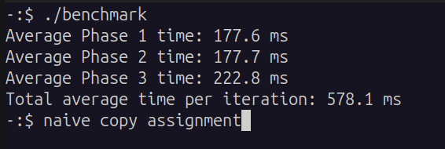
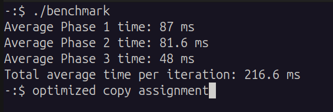
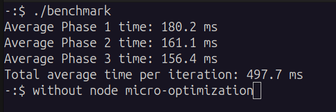
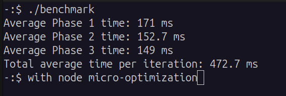

# Stack

A LIFO (Last-In-First-Out) data structure implemented using a singly-linked list with an optimized copy assignment operator.

## Overview

The Stack implementation provides standard stack operations with a focus on performance optimization. Unlike typical implementations, this stack features a highly optimized assignment operator that reuses existing nodes instead of deallocating and reallocating memory, achieving significant performance improvements.

## Features

- **O(1) push, pop, and peek** operations
- **Optimized assignment operator** - Reuses existing nodes for 2.5x average speedup
- **Memory efficient** - No wasted capacity like array-based implementations
- **Micro-optimized** - Node constructor omits unnecessary initialization
- **Fully tested** - Comprehensive test suite including Rule of Three validation

## Usage

```cpp
#include "stack.h"

// Create an empty stack
Stack<int> stack;

// Push elements
stack.push(10);
stack.push(20);
stack.push(30);

// Peek at top element
int top = stack.peek();         // Returns 30 (doesn't remove)

// Pop elements
int value = stack.pop();        // Returns 30 (removes from stack)

// Query state
std::cout << stack.getSize();   // Number of elements
std::cout << stack.isEmpty();   // Check if empty

// Clear all elements
stack.clear();
```

## Core Operations

### `void push(T element)`
Pushes an element onto the top of the stack.
- **Parameters**: `element` - The value to add
- **Complexity**: O(1)

### `T pop()`
Removes and returns the top element.
- **Returns**: The top element
- **Complexity**: O(1)
- **Throws**: `std::out_of_range` if stack is empty

### `const T& peek() const`
Returns the top element without removing it.
- **Returns**: Const reference to the top element
- **Complexity**: O(1)
- **Throws**: `std::out_of_range` if stack is empty

### `void clear()`
Removes all elements from the stack.
- **Complexity**: O(n)

### `int getSize() const`
Returns the number of elements in the stack.
- **Returns**: Element count
- **Complexity**: O(1)

### `bool isEmpty() const`
Checks if the stack is empty.
- **Returns**: `true` if empty, `false` otherwise
- **Complexity**: O(1)

## Performance Optimization

### Optimized Assignment Operator

The copy assignment operator is the centerpiece of this implementation's optimization strategy. Instead of the naive approach (delete all nodes, then allocate new ones), this implementation **reuses existing nodes** whenever possible.

#### Strategy

The assignment operator handles three cases:

1. **Reuse existing nodes**: When both stacks have overlapping sizes, update values in-place
2. **Append new nodes**: When source is larger, allocate only the additional nodes needed
3. **Delete excess nodes**: When source is smaller, delete only the extra nodes

This approach minimizes heap operations (new/delete), which are significantly more expensive than simple value assignments.

#### Benchmark Results

The optimization was validated through extensive benchmarking with 10 million element stacks over 10 iterations.

**Test Scenarios:**
- **Phase 1**: Assign 10M elements to stack with 5M elements (grow)
- **Phase 2**: Assign 5M elements to stack with 10M elements (shrink)
- **Phase 3**: Assign 10M elements to stack with 10M elements (equal size)

**Results:**

| Scenario | Naive Implementation | Optimized Implementation | Speedup |
|----------|---------------------|--------------------------|---------|
| Phase 1 (grow) | 177.6 ms | 87 ms | **2.04x faster** |
| Phase 2 (shrink) | 177.7 ms | 81.6 ms | **2.18x faster** |
| Phase 3 (equal) | 222.8 ms | 48 ms | **4.64x faster** |
| **Overall Average** | **578.1 ms** | **216.6 ms** | **2.67x faster** |

The equal-size case shows the most dramatic improvement (4.64x) because it reuses 100% of nodes, performing only value assignments with zero heap operations.




*Comparison of naive vs optimized assignment operator performance*

### Node Constructor Micro-Optimization

A second optimization involves the node constructor. Standard practice initializes the `next` pointer to `nullptr`:

```cpp
node(T v) : value(v), next(nullptr) {}  // Standard approach
```

However, in this stack implementation, the `next` pointer is **always** set immediately after node creation in `push()`:

```cpp
node<T>* newNode = new node<T>(element);
newNode->next = data;  // next is set here anyway
```

Therefore, initializing `next` to `nullptr` in the constructor is redundant work. The optimized version omits this initialization:

```cpp
node(T v) : value(v) {}  // Optimized - no next initialization
```

#### Benchmark Results

Testing this micro-optimization with the same 10M element workload over 10 iterations:

| Metric | With `next(nullptr)` | Without initialization | Improvement |
|--------|---------------------|------------------------|-------------|
| Phase 1 | 180.2 ms | 171 ms | **5.1% faster** |
| Phase 2 | 161.1 ms | 152.7 ms | **5.2% faster** |
| Phase 3 | 156.4 ms | 149 ms | **4.7% faster** |
| **Total** | **497.7 ms** | **472.7 ms** | **5% faster** |




*Impact of removing next pointer initialization*

**Analysis**: The improvement is modest (5%) but consistent. The saved initialization becomes negligible compared to allocation overhead, but demonstrates attention to eliminating unnecessary operations.

**Trade-off**: This optimization sacrifices defensive programming (initialized pointers) for marginal performance gain. It's safe in this implementation because `next` is always set before use, but requires careful code review to ensure no code path reads `next` before setting it.

### Running the Benchmarks

The benchmark code includes both implementations with strategic comment blocks. To test different configurations:

1. **Test optimized vs naive assignment operator:**
   - Comment/uncomment the assignment operator implementations in `stack.h`
   - The optimized version is active by default
   - The naive version is commented out below it

2. **Test node initialization impact:**
   - In the node constructor, toggle the comment on `next(nullptr)`:
   ```cpp
   node(T v) : value(v)/*, next(nullptr)*/ {};  // Currently omitted
   ```

3. **Compile and run:**
   ```bash
   g++ -std=c++17 -O2 benchmark.cpp -o benchmark
   ./benchmark
   ```

**Note**: The benchmark measures the the copy assignment by default. To benchmark the node initialization optimization:
- Uncomment the timing around `push()` operations
- Comment the timing around `second = first;`

The code includes commented timing blocks at both locations - choose which operation to benchmark by toggling the comments.

## Design Decisions

### Singly-Linked List Implementation

The stack uses a singly-linked list rather than an array-based implementation:

**Advantages:**
- True O(1) push/pop with no amortization needed
- No wasted capacity (array-based stacks may have unused allocated space)
- No reallocation costs (array-based stacks occasionally need to resize)

**Disadvantages:**
- Higher memory overhead (pointer per element)
- Poor cache locality (nodes scattered in memory)

For a stack, where we only ever access the top element, the singly-linked list is the ideal choice.

### Cleanup Strategy

The `cleanup()` helper method is designed to be called by both the destructor and `clear()`:

```cpp
void cleanup() {
    // Deletes all nodes but does NOT reset size or data pointer
}
```

**Why separate cleanup from reset?**
- The destructor calls `cleanup()` but doesn't need to reset member variables (object is dying)
- The `clear()` method calls `cleanup()` and then resets `size` and `data`
- Avoids redundant work in the destructor

This is a minor optimization that eliminates unnecessary assignments when the object is being destroyed.

## Complexity Analysis

| Operation | Time Complexity | Space Complexity |
|-----------|----------------|------------------|
| `push()` | O(1) | O(1) |
| `pop()` | O(1) | O(1) |
| `peek()` | O(1) | O(1) |
| `clear()` | O(n) | O(1) |
| `getSize()` | O(1) | O(1) |
| `isEmpty()` | O(1) | O(1) |
| Copy constructor | O(n) | O(n) |
| Assignment (optimized) | O(min(n,m)) + O(|n-m|) | O(|n-m|)* |

*Where n = target size, m = source size. Space complexity is for the difference in nodes that need to be allocated/deallocated.

## Implementation Notes

### Rule of Three

The stack correctly implements the Rule of Three:
1. **Destructor** - Frees all allocated nodes
2. **Copy constructor** - Deep copies the entire stack
3. **Copy assignment operator** - Optimized version that reuses nodes

All three are thoroughly tested in `test_rule_of_three_stack.cpp`.

### Exception Safety

Operations throw `std::out_of_range` when attempting to access an empty stack:
- `pop()` on empty stack
- `peek()` on empty stack

The implementation provides **basic exception safety**: if an exception is thrown during an operation, the stack remains in a valid (though possibly modified) state.

### No Move Semantics

Move semantics (move constructor and move assignment operator) are intentionally omitted to keep the implementation focused on the core optimization strategy without additional C++11 complexity.

---

**Part of the Data Structures Portfolio**  
[Previous: Dynamic Array](../dynamic_array/README.md) | [View Repository](../) | [Next: Queue](../deque/README.md)
